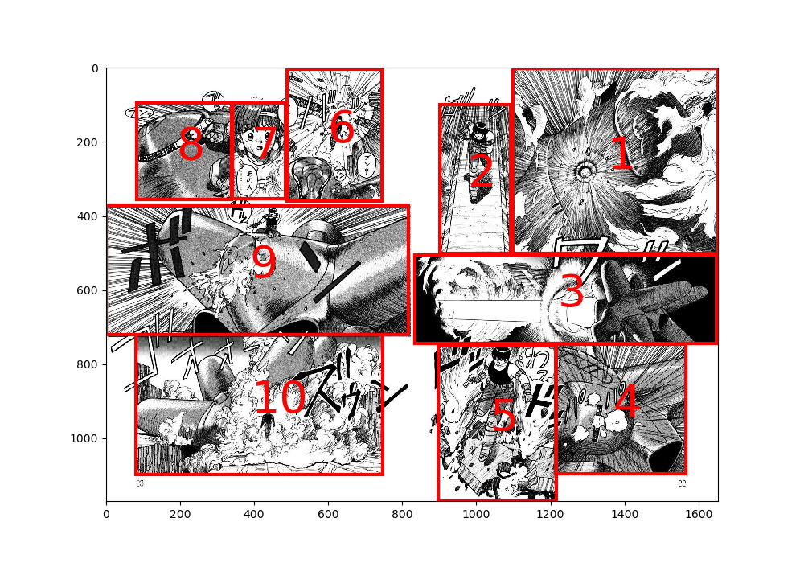
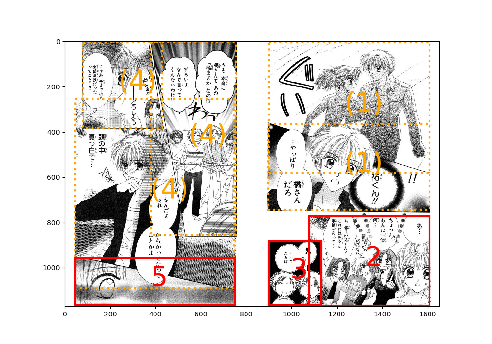
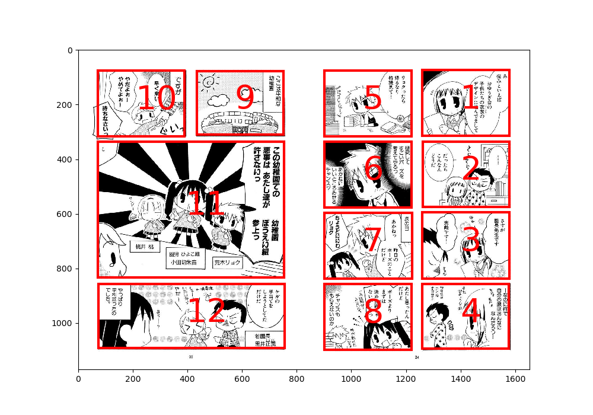

# Comic Panel Order Estimator
This tool uses the method described by Kovanen et al. [1] to estimate the order of comic panels as follows:

- Given a set of panel bounding boxes within a double-sided comic page, it estimates the order of the panels based on [1]. Available as `main.py`.
- Finds the order of all of the bounding boxes for the pages in the dataset. Available as `main-all.py`.

This tool does not do the following:

- Panel bounding box detection. This must be done separately or be provided manually.

Here is an example of the panel detection result:



(Comic: ARMS, by Masaki Kato)


## Setup
First install the Python package requirements:
```bash
pip install manga109api
```

Also, place the [Manga109 dataset](https://www.manga109.org/) somewhere in your local environment.

This tool expects the dataset structure to follow the format for [Manga109 dataset](https://www.manga109.org/).
Custom datasets can be used with this tool by editing the Manga109 dataset or organizing your own dataset in the Manga109 format.


## Usage
There are two scripts:

- `main.py`: Visualizes the panel orders of a given page of a given title using matplotlib
- `main-all.py`: A minimal example for enumerating all of the panel orders for all of the pages in the entire dataset


### `main.py`
Basic usage:

```bash
python main.py --title ARMS --page 10 \
    --dataset-root ./dataset/Manga109_released_2021_02_28
```

This command yields the image shown at the top of this page.


For four-panel comics, the `--initial-cut two-page-four-panel` option must be specified:

```bash
python main.py --title YouchienBoueigumi --page 10 --initial-cut two-page-four-panel \
    --dataset-root ./dataset/Manga109_released_2021_02_28
```

All of the available options are as follows:

```bash
python main.py --title YouchienBoueigumi --page 10 \
    --dataset-root ./dataset/Manga109_released_2021_02_28 \
    --threshold 0.25 \
    --initial-cut two-page-four-panel
```

The `--threshold` and `--initial-cut` options are explained in the "Explanation" section.

This command yields the image shown at the top of this page.


### `main-all.py`
```bash
python main-all.py --dataset-root ./dataset/Manga109_released_2021_02_28
```


## Explanation
The panel ordering algorithm is based on Kovanen et al. [1].
The algorithm consists of the tree construction phase and the tree interpretation phase:

Tree construction phase:

1. If the current set of panels is separable into two parts with a horizonal line (the pivot),
    - Separate the set, and for each set, start from Step 1
2. Otherwise, if the current set of panels is separable into two parts with a vertical line (the pivot),
    - Separate the set, and for each set, start from Step 1 (not 2)
3. Otherwise, mark the set as inseparable

Tree interpretation phase:

- Traverse the horizontal/vertical division tree, providing the panel orders on the way as follows:
  - For horizontal divisions, visit the top branch first, and then the bottom branch
  - For vertical divisions, visit the right branch first, and then the left branch
  - When a leaf node is encountered, provide the newest order index to that node
    - A leaf node may either be an individual panel or a set of panels inseparable with a pivot (under the given threshold)

The tree construction phase recursively divides the set of panels to create a tree structure, which is later used to determine the panel orders.
For each horizontal and vertical division in the tree construction phase, a node representing the division is created.
The inseparable sets in Step 3 become the leaf nodes of this tree, and are either individual panels or a set of overlapping panels.
The recursive tree structure used here is accessible using `BoxOrderEstimator.boxnode.bbset`.


### Panel Separation Threshold Details
Panel separation is done as follows:

1. Choose a horizontal/vertical division pivot.
2. For each panel, determine if the panel is separable with the pivot.
    - If there is any panel that is inseparable with the pivot, mark the pivot as invalid.
    - If all of the panels are separable with the pivot, return the sets of panels separated with the pivot.

Whether a panel is separable with a pivot is determined as follows:

- If the pivot does not pass through the panel, it is separable.
- If the pivot passes through the panel,
  - Find the ratio of how much of the panel is cut through with the pivot. The ratio is determined as the area of the smaller half of the separated panel areas, divided by the entire area.
  - If the ratio is smaller than a given fixed threshold, the pivot is valid and the panel is separable (the pivot cuts a small enough size of the panel). If the ratio is larger than the threshold, the pivot is invalid and the panel is inseparable.

The `--threshold` option specifies the ratio threshold used in this step.


### Initial cuts
The algorithm above does not generally work for side-by-side pages (which are most of the pages in the Manga109 dataset), since side-by-side pages are actually two individual pages concatenated to one page. For such pages, each page must be managed separately, or else the algorithm will mix up the rows of each page as one single row.

To initially separate the page into two sets, there is an option to initially provide a vertical pivot that crosses the center of the page image so that it separates the left and right pages. This manual vertical pivot is required since the algorithm first looks for horizontal divisions before looking for vertical ones.

Similarly, four-panel comics such as Youchien Boueigumi (by Tenya) in the Manga109 dataset is actually _four_ different pages concatenated to one page. For such pages, the algorithm must initially try three vertical pivots (which divides the page into four parts).

The `--initial-cut` option is used to handle such cases. This option can take the following choices:

- `one-page` - No initial pivots are used
- `two-page` (default) - One initial vertical pivot along the center is used
- `two-page-four-panel` - For four-panel comics; three initial vertical pivots are used

By default, `--initial-cut` is set to `two-page`, which is the case for most of the comics in the Manga109 dataset.
The `one-page` option is intended for spreaded pages, but even for such pages, the default `two-page` option works for most cases.
Therefore, it should be sufficient to only occasionally use `two-page-four-panel` for four-panel comic data as for this option.


## Overlapping Panels
When a set of inseparable panels remains in the leaf node, the set as a whole is given a single order, and are shown in dotted-line bounding boxes:



(Comic: Prism Heart, by Mai Asatsuki)

The list of panels for such overlapping panels are stored in the field `BoundingBox.panels` defined in `order_estimator.py`.


## Special Options for Four-Panel Comics
As mentioned in the Usage section, four-panel comics require a special option.

Here is an estimation result for four-panel comics:

```bash
python main.py --title YouchienBoueigumi --page 10 --initial-cut two-page-four-panel
```



(Comic: Youchien Boueigumi, by Tenya)

Notice that due to the design of the pivot separation algorithm, the left half of the page is successfully ordered as a usual non-four-panel comic even with the `two-page-four-panel` option. On the other hand, the right half of the page is successfully separated as a four-panel comic page. (Without this option, the panels on the right half would be ordered as 1, 5, 2, 6, and so on.)


## References
Paper [1]:

```
@INPROCEEDINGS{7351614,
  author={Kovanen, Samu and Aizawa, Kiyoharu},
  booktitle={2015 IEEE International Conference on Image Processing (ICIP)},
  title={A layered method for determining manga text bubble reading order},
  year={2015},
  volume={},
  number={},
  pages={4283-4287},
  doi={10.1109/ICIP.2015.7351614}}
```


The following papers are related to the Manga109 dataset.

When publishing results that depend on the Manga109 dataset, please cite the following papers:

```
@article{mtap_matsui_2017,
    author={Yusuke Matsui and Kota Ito and Yuji Aramaki and Azuma Fujimoto and Toru Ogawa and Toshihiko Yamasaki and Kiyoharu Aizawa},
    title={Sketch-based Manga Retrieval using Manga109 Dataset},
    journal={Multimedia Tools and Applications},
    volume={76},
    number={20},
    pages={21811--21838},
    doi={10.1007/s11042-016-4020-z},
    year={2017}
}

@article{multimedia_aizawa_2020,
    author={Kiyoharu Aizawa and Azuma Fujimoto and Atsushi Otsubo and Toru Ogawa and Yusuke Matsui and Koki Tsubota and Hikaru Ikuta},
    title={Building a Manga Dataset ``Manga109'' with Annotations for Multimedia Applications},
    journal={IEEE MultiMedia},
    volume={27},
    number={2},
    pages={8--18},
    doi={10.1109/mmul.2020.2987895},
    year={2020}
}
```
